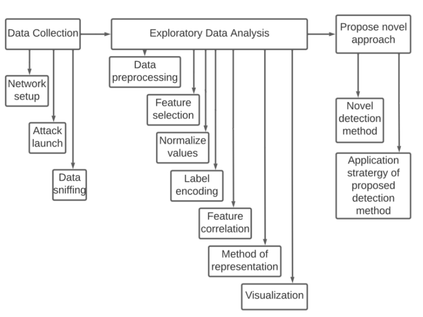

# smart-home-device-attack-detection-
This is the GitHub repo for the collaborative research work carried out  by Asmau Wali-Zubair (PhD student) as the lead researcher, and contributed to by myself (Oluwasegun Apejoye) and Thejavathy Vengappa, both MSc Students, under the supervision of Dr. Jun He and Dr. Xiaoqi Ma at Nottingham Trent University, Nottingham, UK.

_**This is an on-going research with aim of creating an innovative approach/tool to address the increasing threat of cyberattacks on smart home IoT devices.**_

_**This readme will guide you through the repo**_
---
The repo contain datasets, python scripts and other outputs from different projects carried out as part of this on-going research. Each heading within this readme presents each project including its abstract, methodology and reference to the relevant files (datasets, code script, etc) within this repo that relates to the project.
- [Project 1](#Project_1)  

# Project_1
A novel approach to identifying DDoS traffic in the smart-home network via Exploratory Data Analysis
---	
## Abstract
Smart homes are gaining more popularity by the day due to the ease they provide in terms of running our homes. However, the energy and resource constrained nature of the smart home devices make security integration challenging, thus making them prone to cyber-attacks. DDoS remains one of the most threatening attacks to this network and IoT in general. In order to curb this issue, there is a need to study the behavioral pattern of this attack and smart home devices at a low level. This will aid in designing a timely and more effective DDoS detection and mitigation framework and policy. DDoS visualization tools can also be improved using this approach. This paper collects DDoS and benign traffic in a real smart home environment and performs an Exploratory Data Analysis (EDA), visualizing the behavioral pattern of 3 types of DDoS flooding attacks when targeted at smart home networks in comparison to the benign smart home traffic pattern. The attacks covered are TCP SYN, ICMP and UDP flooding attacks. For each of the covered attacks, specific smart home traffic properties were selected, correlated and visualized showing their reversed behavior during an attack compared to their normal benign nature. To further validate the findings, public IoT datasets were analyzed in the same manner and the same results were achieved. Finally, this paper proposes a novel approach on how the EDA findings can be applied to better detect DDoS traffic in the smart home network.

## Methodology

_**Dataset Used**_ 
* _Benign data_: Normal smart home traffic was collected here, which was generated from using the smart home devices. [see private data](data/private_data/)
* _Attack data_: Three types of DDoS flooding attacks (TCP SYN, UDP and ICMP) were launched on the smart home network and the traffic from this attack was collected. Each attack was collected separately. [see private data](data/private_data/)
* _Public dataset_: A public normal smart home dataset and IoT attack dataset for TCP SYN, UDP and ICMP were sourced from different sources: [Tcpsyn](); [UDP](); [ICMP](); [benign](). These are used for validation purposes as they are also subjected to the same EDA process as the private smart home attack and benign data collected in this research.

_**Exploratory Data Analysis**_
The following processes were followed to analyse the private and public data.
* _Data preprocessing_: Each dataset was filtered to have only the relevant traffic flows from the target devices needed for analysis. This involves eliminating background traffic generated by other devices on the network.
* _Feature selection_: The corresponding attack and benign network traffic properties to be analyzed were selected and extracted. The most affected benign traffic properties during an attack were chosen and filtered out. This was done for each attack. These properties include protocol, packet length, sequence number and TCP flags bearing in mind the time stamps and packet ID or frame number for each packet.
* _Data normalization_: Among the selected network features, those with a wide range of numeric values were normalized using the min-max scalar to have a more befitting range during visual representation. These features are packet length and packet sequence.
* _Label encoding_: Non numerical values like the various protocols were encoded using a numerical value. This means each protocol corresponds to a number on the plotted figures.
* _Feature correlation_: The selected benign features were analyzed side by side to find out if they get affected simultaneously during an attack. This was tested for each of the 3 attacks covered.
* _Method of representation_: Various methods of visual representation were used like bar charts, pie charts, frequency polygons and scatter plots. The most befitting method of representation was chosen based on the network feature(s) being visualized.
* _Visualization_: Python programing was used on Google Colab to analyse and plot the charts and graphs (see [eda/eda_script.ipynb](eda/eda_script.ipynb)). Corresponding network features for each attack and benign scenario were compared. Each of the analyzed network feature (protocol, packet length, sequence number, TCP flag) was plotted against the respective frame number of the corresponding packet.

Publications related to this project (because we have more in future):
1. Wali, A., Apejoye, O., He, J. and Ma, X., 2021, December. [An Exploratory Data Analysis of the Network Behavior of Hive Home Devices](https://ieeexplore.ieee.org/abstract/document/9704944/). In 2021 8th International Conference on Internet of Things: Systems, Management and Security (IOTSMS). IEEE.
> Please direct all questions or enquiry to Asmau via [email](n0825492@my.ntu.ac.uk)

